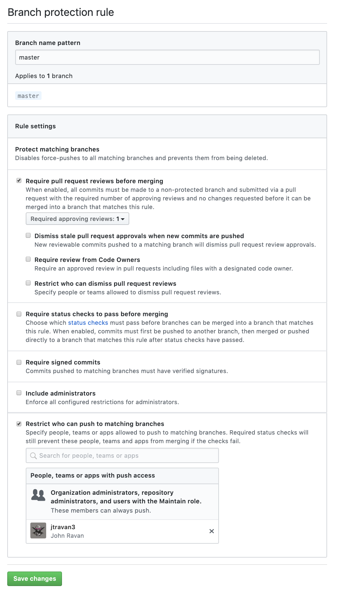

# CSCI-603, Object-Oriented Design Patterns


## Overview

This repository contains all examples and assignments for [CSCI 603, Object-Oriented Design Patterns](http://www.citadel.edu/root/ccs-courses/graduate#csci603) offered at The Citadel. 
The course was taught W 5:30 PM-8:30 PM in Spring of 2020.

This code is a compilation of the [Design Patterns: Elements of Reusable Object-Oriented Software ](https://www.amazon.com/Design-Patterns-Elements-Reusable-Object-Oriented/dp/0201633612/ref=sr_1_3?keywords=gang+of+four&qid=1583344094&sr=8-3) and 
some of my own code to help with illustrations and coding examples. Any questions can be directed to me directly at [ravanj1@citadel.edu](mailto:ravanj1@citadel.edu)

Cloning this repository will give you a clean slate of all the examples from the `master` branch.

This repository is used in conjunction with [Github Classrooms](https://classroom.github.com/) so that students have their own private cloned repository and can work their own solutions. They will work their own solutions,
push their responses to their repositories, and then the instructor can then grade the solution within GitHub.

If you are a faculty member using this repository, you will want to go to each student repository and protect the `master` branch so that changes can only be submitted through pull requests.
This gives you a forum for a code review and grading.

1.) Go to https://github.com/CitadelCS/csci-603-spring-2020-assignments-{userName}/settings/branches

2.) Click `Add rule`

3.) Add the branch name pattern as `master`

4.) Check `Require pull request reviews before merging`

5.) Check `Restrict who can push to matching branches` and add yourself

6.) Click ` Save changes`

7.) Success! It should look like the image below



## Usage

This repository has all coding examples and base classes for CSCI 603. Use this repository as a base for creating Github Classrooms ([classroom.github.com](https://classroom.github.com/)).

## Environment Setup (Faculty)

1.) Install maven 3.6.0 and Java JDK 11. JDK located [here](https://openjdk.java.net/install/). If you have a Mac you can use `brew`.

```bash
brew install maven
```

2.) Clone down the repository from Github

```bash
git clone git@git.github.com:CitadelCS/csci-603.git
```

3.) Build the project

```bash
mvn clean install
```

You should see a success if everything is set up correctly.

5.) Run the sample you wish by running each file with a main method

## Environment Setup (Students)

1.) Install maven 3.6.0 and Java JDK 11. JDK located [here](https://openjdk.java.net/install/). If you have a Mac you can use `brew`.

```bash
brew install maven
```

2.) Create your personal repository from Github. You should receive a unique link from your professor from Github Classroom that will generate a private repository within your Github account.
It should look something like this.

```bash
https://classroom.github.com/a/{classroomId}
```

3.) This will create your personal repository within the [Citadel CS Github Organization](https://github.com/CitadelCS). From here you'll be able to create
pull requests for all of your assignments. The easiest way to do this is cloning down your repository to your local machine.

4.) Clone down the repository from Github

```bash
git clone git@git.github.com:CitadelCS/csci-603-assignments-spring-2020-{yourUsername}.git
```

5.) Build the project

```bash
mvn clean install
```

You should see a success if everything is set up correctly.

6.) Run the sample you wish by running each file with a main method

## Assignments

Within the folder `assignments` there is a subfolder for each assignment with a `README.md` with the assignment instructions. Students are to read the document and complete the assignment by
submitting their code within their private repository for the submitter and the instructor to see.

You will submit each assignment by submitting a pull request of an assignment branch into master. Below are the steps on how to do this

1.) After completing the assignment within your private repository create a branch for the assignment

```bash
git checkout -b assignment/{assignmentNumber}
```

2.) Add all of your changed files to the newly created branch

```bash
git add .
```

3.) Commit all of the added files to your branch with a message

```bash
git commit -m "Initial attempt of assignment 1"
```

4.) Now that all of your changes have been commit to the new branch, push the new branch to your remote repository.

```bash
git push origin assignment/{assignmentNumber}
```

5.) Visit your repository through [github.com](https://www.github.com) and open a pull request for merging your assignment branch into
your `master` branch. From here, your professor will give you feedback on your code and will guide you on how to submit changes.

## IDE (IntelliJ)

I will be using the IDE IntelliJ for all coding examples. You can use any IDE that you choose (Eclipse, Netbeans, etc.) however,
I will only be able provide assistance for IntelliJ.

IntelliJ is quite expensive however students/instructors can receive a free license by filling out an application with their
school email address. Simply go to [https://www.jetbrains.com/student/](https://www.jetbrains.com/student/) and fill out an
application in order to receive your free license.

If you don't plan to use IntelliJ I recommend using [VS Code](https://code.visualstudio.com/). I **strongly** discourage the use
of Eclipse because of the way it displays markdown files.

Happy coding!

