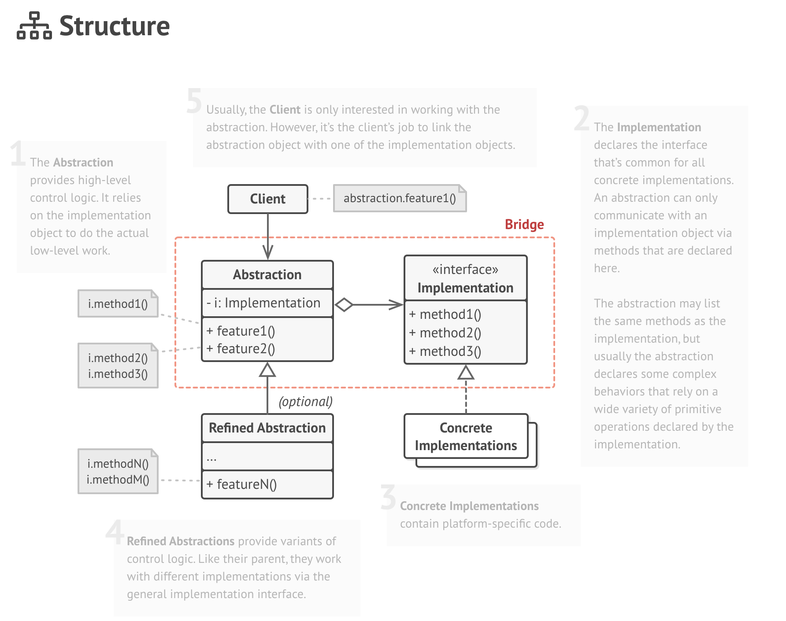

# Bridge Design Pattern

## Overview

This is a structural design pattern where the intent is to separate the abstraction from
the implementation. There are two main parts to this design pattern. They are

1. Abstraction
1. Implementation

## How To Implement

1. Identify the orthogonal dimensions in your classes. These independent concepts could be: abstraction/platform, 
domain/infrastructure, front-end/back-end, or interface/implementation.

1. See what operations the client needs and define them in the base abstraction class.

1. Determine the operations available on all platforms. Declare the ones that the abstraction needs in the general implementation 
interface.

1. For all platforms in your domain create concrete implementation classes, but make sure they all follow the implementation 
interface.

1. Inside the abstraction class, add a reference field for the implementation type. The abstraction delegates most of the 
work to the implementation object that’s referenced in that field.

1. If you have several variants of high-level logic, create refined abstractions for each variant by extending the base abstraction class.

1. The client code should pass an implementation object to the abstraction’s constructor to associate one with the other. 
After that, the client can forget about the implementation and work only with the abstraction object.

## Resources

* [https://en.wikipedia.org/wiki/Bridge_pattern](https://en.wikipedia.org/wiki/Bridge_pattern)
* [https://www.geeksforgeeks.org/bridge-design-pattern/](https://www.geeksforgeeks.org/bridge-design-pattern/)
* [https://refactoring.guru/design-patterns/bridge](https://refactoring.guru/design-patterns/bridge)