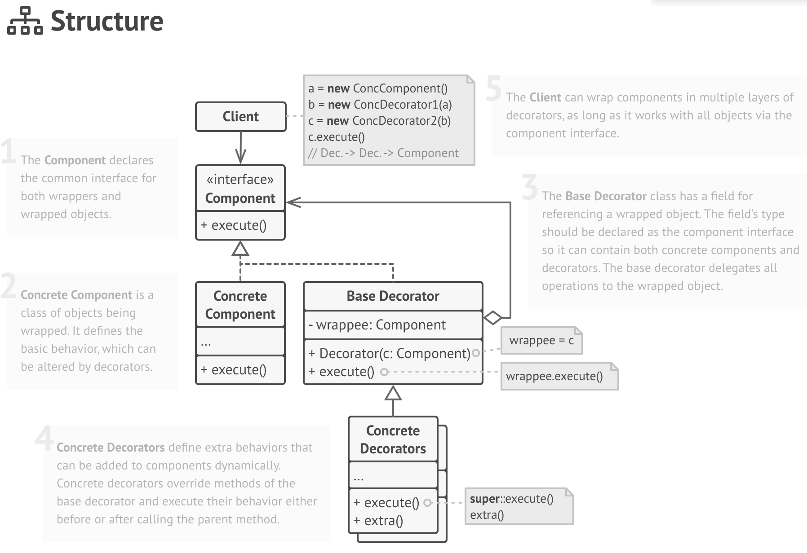

# Decorator Design Pattern

## Overview

This is a structural design pattern where the intent is to attaches additional 
responsibilities to an object dynamically. Decorators provide a flexible alternative to subclassing for extending functionality.

## How To Implement

1. Make sure your business domain can be represented as a primary component with multiple optional layers over it.

1. Figure out what methods are common to both the primary component and the optional layers. Create a component interface 
and declare those methods there.

1. Create a concrete component class and define the base behavior in it.

1. Create a base decorator class. It should have a field for storing a reference to a wrapped object. The field should be 
declared with the component interface type to allow linking to concrete components as well as decorators. The base decorator 
must delegate all work to the wrapped object.

1. Make sure all classes implement the component interface.

1. Create concrete decorators by extending them from the base decorator. A concrete decorator must execute its behavior before 
or after the call to the parent method (which always delegates to the wrapped object).

1. The client code must be responsible for creating decorators and composing them in the way the client needs.

## Resources

* [https://en.wikipedia.org/wiki/Decorator_pattern](https://en.wikipedia.org/wiki/Decorator_pattern)
* [https://www.geeksforgeeks.org/decorator-pattern/](https://www.geeksforgeeks.org/decorator-pattern/)
* [https://refactoring.guru/design-patterns/decorator](https://refactoring.guru/design-patterns/decorator)